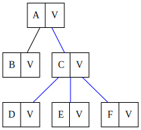

# Graph Crawler

## Graph
First, imagine a graph



where A, B, C, D, E, F are some vertices identifiers (or keys) and V are some values, which are associated with the said vertices. This can be described by the following type definition:

```go
type Result[K comparable, V any] struct {
	Key   K
	Value V
}
```
where K is a key type and V is a value type.

## Crawling
Traversing (i.e. "crawling") a graph means visiting all its vertices. Some real world examples of this process are following links of a web site or browsing the file system on a computer.

To implement necessary behavior we need to write a transformation function, which signature is described by the following types:

```go
type Vertice[K comparable, V any] interface {
	Value() V
	Keys() []K
}

type Transformer[K comparable, V any] func(t K) Vertice[K, V]
```
This function takes the current vertice's key and returns a value, which can be used to obtain keys of adjacent vertices as well as the value, associated with the current vertice. Calling this function actually performs traversing from one vertice to several others. The crawler carries out this task in parallel.

Supply this function to the crawler alongside with the output channel for retrieving the results:

```go
crawler.Crawl(base, depth, transform, out)
```
where
- base - key of the initial vertice, from which the crawling process starts
- depth - crawling depth - the number of hops between the vertices
- transform - our transformation function
- out - channel of type ```Result[K,V]```

For the web crawler implementation see https://github.com/liaozhai/web